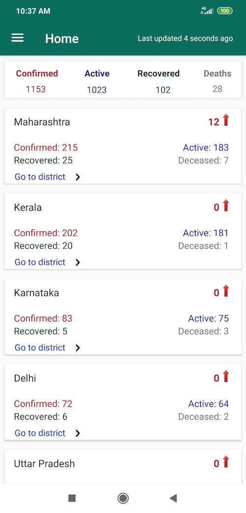

# Covid-19-India-Android

This application show covid19 statics cases based on source( Covid-19 org) Intension to aware public based on statics data.

This application show positive confirm cases as well as show active, recovered and deceased rates in india based on reliable sources. This application can be refreshed on action of pull to refresh or will be refreshed automatically in interval of 5 min to make sure visible data is update always.

This statics help to people aware of reported cases and which region of india is most affected cause of spread of covid-19 virus.

### Thank you [Covid-19 India Org team](https://github.com/covid19india) 

Screenshot for reference:

